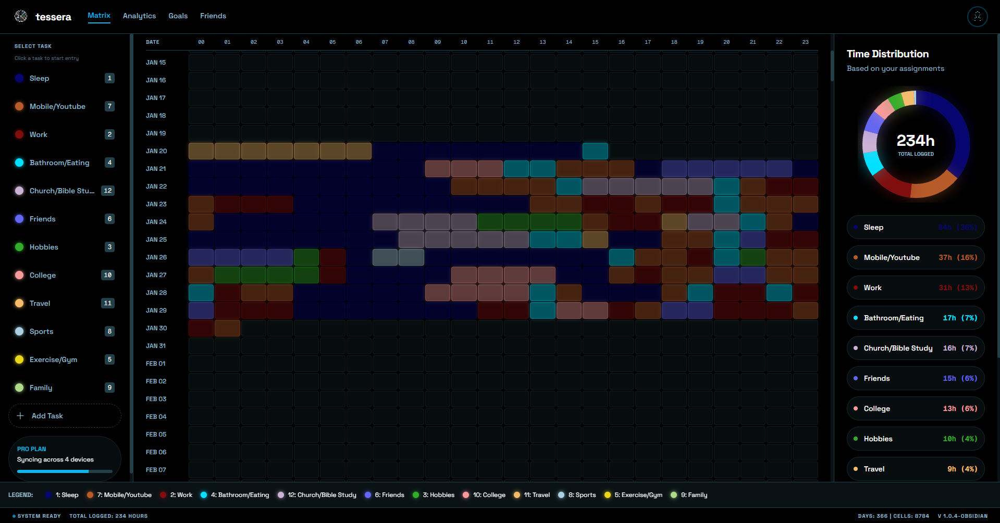
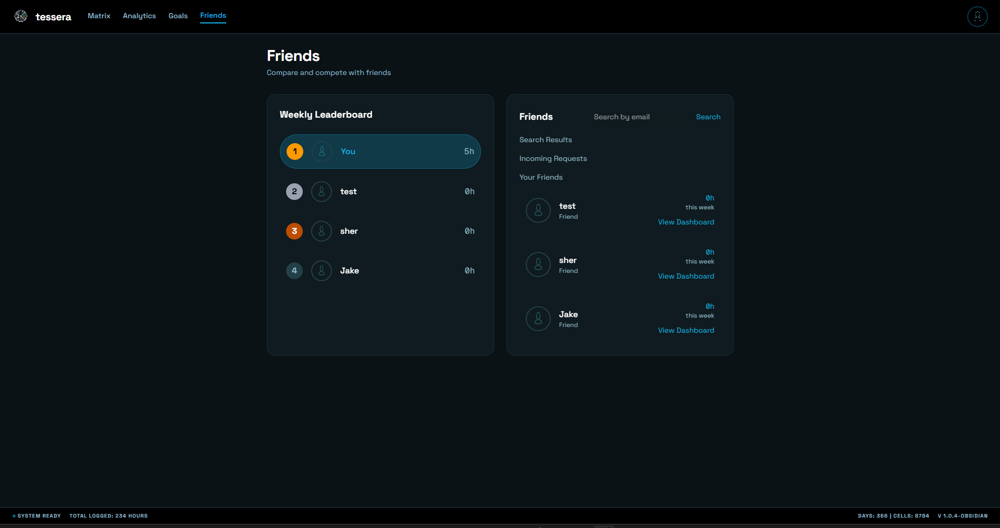

# Tessera

Tessera is a dark-themed, hour-by-hour time-tracking matrix built with Next.js. It focuses on precise logging, visual analytics, and lightweight social features (friends and leaderboards) so you can track, analyze, and compare how you spend time.

**Screenshots**

- Matrix overview: `public/screenshots/matrix-overview.png`
- Friends dashboard: `public/screenshots/friends.png`
- Analytics & breakdown: `public/screenshots/analytics.png`

Place the provided screenshots in `public/screenshots/` with those filenames to render them in this README.

**Overview**

- Purpose: fast, granular time capture using a compact matrix UI (days × 24 hours).
- Interaction model: select a task from the sidebar and paint hours on the matrix; confirm or clear selections from the right panel.
- Visuals: pie chart, weekly activity, and task breakdown provide immediate insight into time allocation.

**Tech Stack**

- Framework: Next.js (App Router)
- UI: React + Tailwind CSS
# Tessera

Tessera is a focused, dark-themed time-tracking matrix application built with Next.js. It provides hour-by-hour logging, visual analytics, and lightweight social features so you can track and compare how you spend your time.

---

## Screenshots

Matrix overview



Friends dashboard



Analytics & breakdown


---

## Highlights

- Hour-by-hour matrix for precise activity logging
- Color-coded tasks with shortcuts and quick-editing
- Visual analytics: time distribution, weekly activity, and task breakdown
- Friends, leaderboards, and per-friend dashboards

## Tech

- Next.js (App Router)
- React + Tailwind CSS
- Optional: Supabase / PostgreSQL for persistence (see `database_setup.sql`)

## Quick start

1. Install dependencies

```bash
npm install
```

2. Add environment variables in `.env.local` (example):

```
NEXT_PUBLIC_SUPABASE_URL=
NEXT_PUBLIC_SUPABASE_ANON_KEY=
DATABASE_URL=
```

3. (Optional) Initialize the database with `database_setup.sql`.

4. Run the app

```bash
npm run dev
```

Open http://localhost:3000

## Where to look

- `app/page.tsx` — main page and interaction logic
- `app/components` — UI components (Header, TaskSidebar, MatrixGrid, RightPanel, Footer)
- `app/api` — server routes for entries, tasks, friends, and auth
- `public` — static assets and images (replace `public/logo.png` to update branding)

## Deployment

Deploy to Vercel or any Next.js host. Add required env vars in your deployment settings.

## Contributing

- Fork, branch, test locally, and open a pull request with screenshots for UI changes.

## License

MIT
